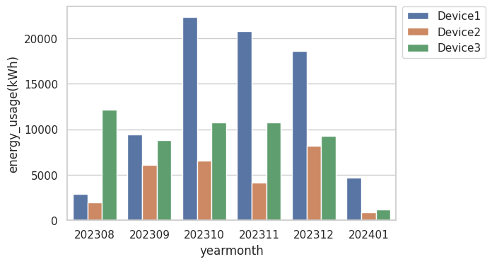

To get monthly energy usasge from all devices into one plot. From today to 6 months back.

Creates the following plot:

Based on:

https://github.com/mihai-dinculescu/tapo/tree/main

https://github.com/mihai-dinculescu/tapo/blob/main/tapo-py/examples/tapo_p110.py

https://github.com/mihai-dinculescu/tapo/blob/main/tapo-py/tapo.pyi
